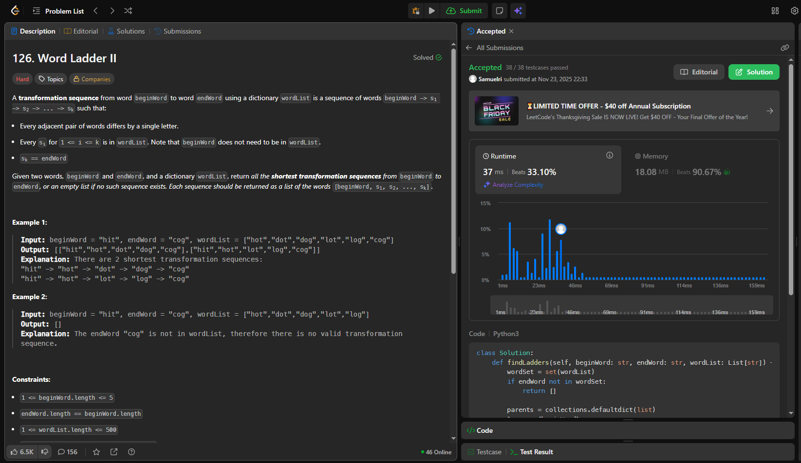

# Trabalho 4 – Grafos 

**Conteúdo da Disciplina:** Estrutura de Dados 2

---

## 👨‍🎓 Aluno

| Matrícula   | Aluno                                               |
|-------------|-----------------------------------------------------|
| 211031486   | Samuel Ribeiro da Costa                |

---

## 📌 Sobre

Este projeto foi desenvolvido como parte da disciplina de Estrutura de Dados 2, com o objetivo de testar e aplicar conhecimentos sobre algoritmos de busca. O trabalho consiste na resolução de problemas do LeetCode que envolvem diferentes técnicas e estratégias de busca, demonstrando a compreensão prática dos conceitos teóricos estudados no módulo.

## 🧠 Questões desenvolvidas

Foram desenvolvidas três questões do LeetCode focadas em algoritmos de busca.

1. [126. Word Ladder II](https://leetcode.com/problems/word-ladder-ii/description/) - Nível difícil
2. [1192. Critical Connections in a Network](https://leetcode.com/problems/critical-connections-in-a-network/) - Nível difícil
3. [847. Shortest Path Visiting All Nodes](https://leetcode.com/problems/shortest-path-visiting-all-nodes/description/) - Nível difícil

---

## 📸 Screenshots

### ✅ Accepted 126. Word Ladder II



### ✅ Accepted 1192. Critical Connections in a Network


### ✅ Accepted 847. Shortest Path Visiting All Nodes


---

## 🎥 Vídeo de apresentação

Neste vídeo, apresentamos um resumo completo do trabalho desenvolvido, abordando os principais pontos discutidos ao longo do projeto.

[Assista no YouTube](https://www.youtube.com/watch?v=-5DL0Qsf-PI)

---
## ⚙️ Execução

Linguagem: Python 3.*

### Pré-requisitos

- Python 3 instalado no sistema.

### Como rodar localmente

Na pasta do projeto, execute um dos arquivos desejados. Exemplos:

```powershell
# Windows PowerShell
python ".\126-Word Ladder II.py"
python ".\1192-Critical Connections in a Network.py"
python ".\847-Shortest Path Visiting All Nodes.py"
```

Opcionalmente, você pode clonar este repositório e executar os arquivos Python diretamente na raiz do projeto.