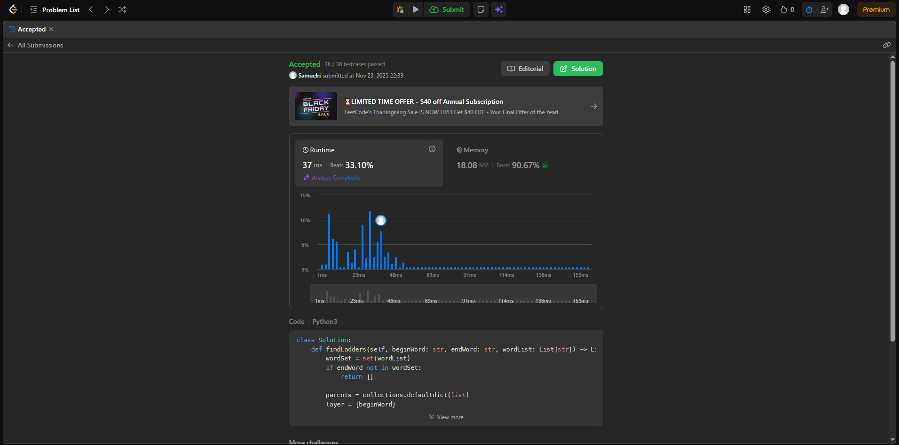
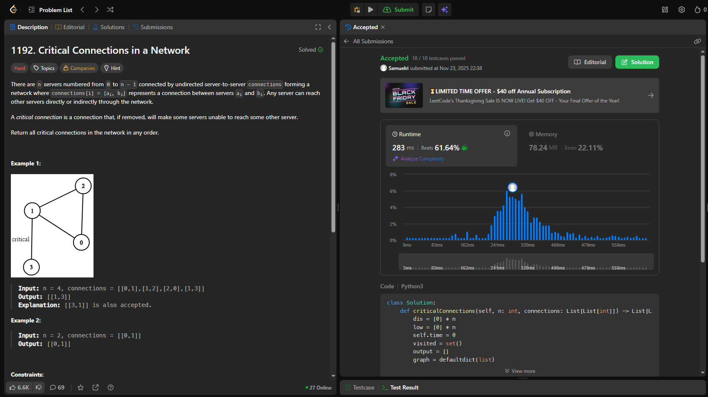
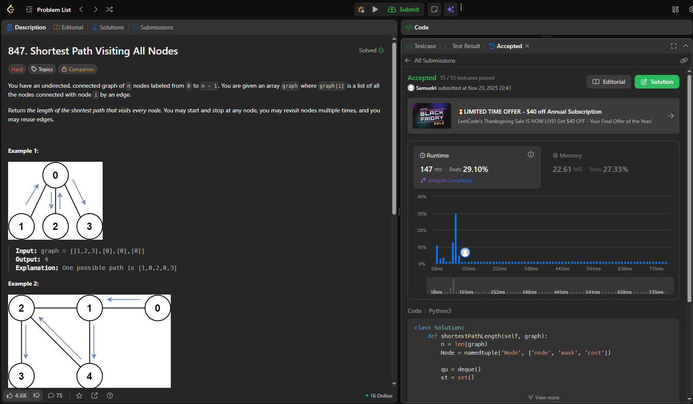

# Traalho 4 Grafos 

**Conteúdo da Disciplina:** Estrutura de Dados 2

---

## 👨‍🎓 Aluno

| Matrícula   | Aluno                                               |
|-------------|-----------------------------------------------------|
| 211031486   | Samuel Ribeiro da Costa                |

---

## 📌 Sobre

Este projeto foi desenvolvido como parte da disciplina de Estrutura de Dados 2, com o objetivo de testar e aplicar conhecimentos sobre algoritmos de busca. O trabalho consiste na resolução de problemas do LeetCode que envolvem diferentes técnicas e estratégias de busca, demonstrando a compreensão prática dos conceitos teóricos estudados no módulo.

## 🧠 Questões Desenvolvidas

Foram desenvolvidas três questões do LeetCode focadas em algoritmos de busca.

1. [126. Word Ladder II](https://leetcode.com/problems/word-ladder-ii/description/) - Nível difícl
2. [1192. Critical Connections in a Network](https://leetcode.com/problems/critical-connections-in-a-network/) - Nível difícl
3. [847. Shortest Path Visiting All Nodes](https://leetcode.com/problems/shortest-path-visiting-all-nodes/description/) - Nível difícl

---

## 📸 Screenshots

### ✅ Accepted 126. Word Ladder II



### ✅ Accepted 1192. Critical Connections in a Network



### ✅ Accepted 847. Shortest Path Visiting All Nodes



---

## 🎥 Vídeo de Apresentação

Neste vídeo, apresentamos um resumo completo do trabalho desenvolvido, abordando os principais pontos discutidos ao longo do projeto.

[Assista no YouTube](https://www.youtube.com/watch?v=-5DL0Qsf-PI)

---
## ⚙️ Instalação

**Linguagem:** Python 3.*

### Pré-requisitos

Python 3 instalado no sistema. 

### Como rodar

Clone o Repositório
```bash
git clone https://github.com/projeto-de-algoritmos-2025/AgoritimoDeBusca_LeeteCode_SAM.git
```
<br>

Navegue até a pasta principal
```bash
cd seuRepositorio/AgoritimoDeBusca_LeeteCode_SAM
```
<br>

Escolha qual código você deseja testar e rode
```bash
python3 nome_do_arquivo.py
```